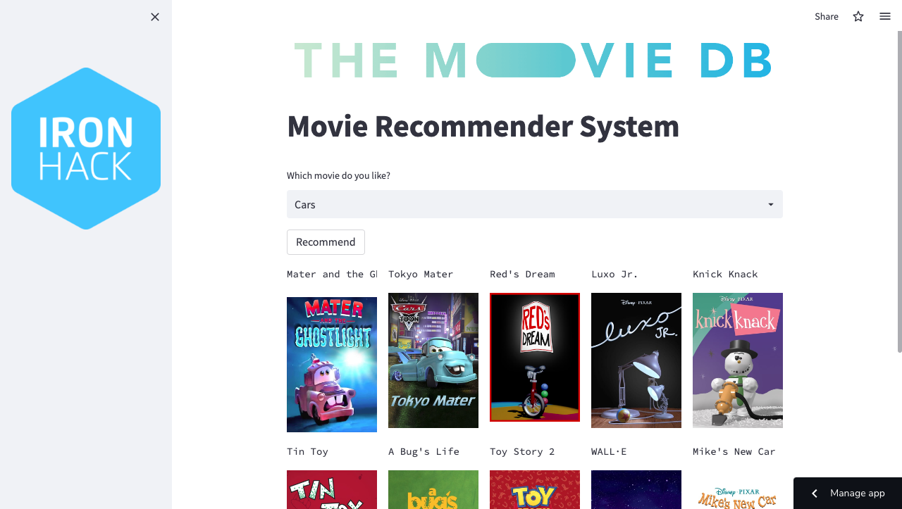

# Final Project - Movie Recommendation System
*Miguel Ángel Hernández Márquez*

*07 de Octubre de 2022, México*

## Content
- [Demo](#demo)
- [Project Description](#project-description)
- [Objective](#objective)
- [Links](#links)

## Demo 

[Here's](https://miguelhermar-i-final-projectfinalproject-streamlitscript-myzj8w.streamlitapp.com/) the final product: 

## Project Description

In this project, I will use **The Movie Database API** to get information such as the plot, cast, crew, budget, and revenues of around 20,000 films. The Movie Database API also provides access to data on many additional movies, actors and actresses, crew, members, and TV shows.

## Objective

I initially do some EDA in order to find correlations between variables and also do somo visualizations to explore the unique values each feature has in my dataset. I then make a simple recommendation system of a movie based on its title, this was displaying 10 recommended movies based on that single feature. A more robust model also appears here where I combined different features like the cast, director, keywords of the movie, etc. This last model displays more intereseting and credible results. For this recommendation system I use **Cosine Similarity** for finding the similarity between 2 movies. How does cosine similarity work?? Let’s say we have 2 vectors. If the vectors are close to parallel, i.e angle between the vectors is 0, then we can say that both of them are “similar”. On the other hand, if the vectors are perpendicular, then we can say that they are independent or NOT “similar”.

Finally, I try to **predict the score or the rating** of a movie. We know that the score of a movie depends on various factors like the genre, or the actor working in the film and mainly the director of the film. Considering all such factors, I will try to build a simple score predictor for this dataset, by taking the average of the scores of the similar movies and find the score for the desired movie.

N.A.: This recommendation system is **content-based**, meaning that the recommendations are based on the description of the products, or in this case of the movies.

## Links
 
[https://miguelhermar-i-final-projectfinalproject-streamlitscript-lz1oeo.streamlitapp.com/](https://miguelhermar-i-final-projectfinalproject-streamlitscript-myzj8w.streamlitapp.com/)
